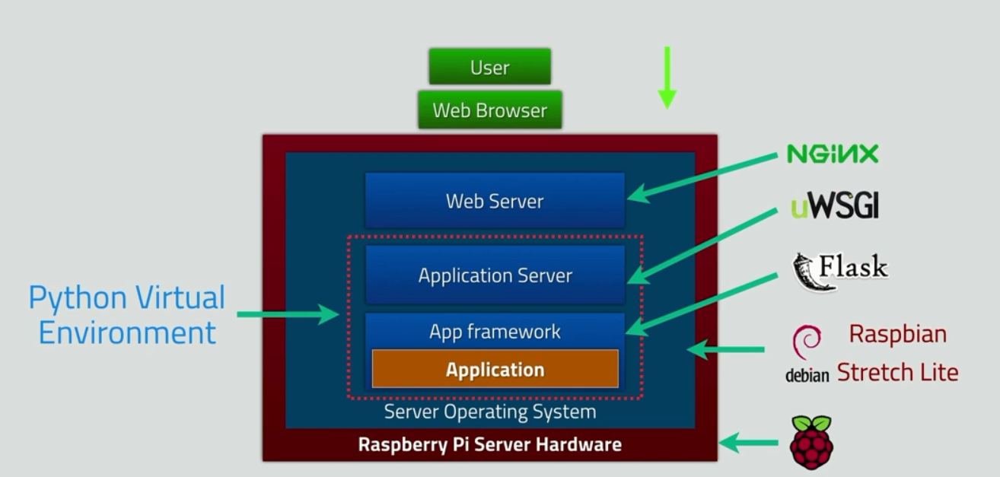
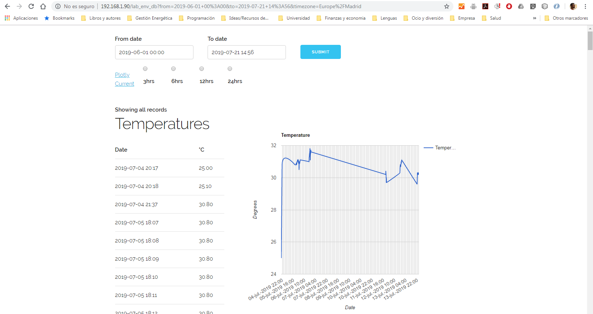

# Web application: Charting Temperature and Humidity Data with Raspberry Pi
This raspberry pi project is from an Udemy course that I took under Dr. Peter Dalmaris. This project
consist of a web server using Raspberry Pi and DHT22 sensor to graph the humidity and temperature over time. 
The data can be accessed over a web browser. 

##### Hardware Technologies I used:
* Rasperry Pi 3 Model B+
* DTH22 Sensor

##### Sofware Technologies I used:
* BackEnd:
    * Flask Python micro-framework
    * uWSGi (application sever)
    * Nginx (light-weight web server)
    * AWS IAM
* Database:
    * SQLite
* FrontEnd:
    * CSS (Skeleton)
    * HTML
    * JavaScript & JQery
    * Google Chart
    * Plotly

##### Final result

    
    